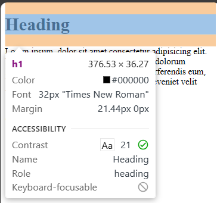

# css <br>

**Level-1** <br>
-> cascading style sheets <br>
-> for designing,styling this is used. <br>

<br>
-> selector tells that on which elements does the style inside apply to. <br>

**if u want to learn more in css u can do so by searching it on mdn website.** <br>

**to include css in a file there are 3 methods:** <br>

1. inline css: <br>
   `<tagname style="property:value" pairs>content</tagname>` <br>
   `<h1 style="color:red">Gracy Gulati</h1>`

2. using style tag (internal css) : <br>
   -> this is done inside head tag.

```
<style>
    h1{
        color:red;
    }
</style>
```

3. external css: <br>
   -> using external stylesheets instead <br>
   -> writing css in a seperate document & linking it with HTML file. <br>
   -> syntax: `<link rel="stylesheet" href="link of css file">` <br>

**priority:** <br>
-> inline style always has most priority. <br>
-> style tag and external css mein uski priority hogi jo baad mein likha jayega <br>
-> like if link rel wli line style tag se upr hogi to style tag ki priority hogi and agr niche hogi link rel wali line to external css ki priority zyda hogi <br>

**color property:** <br>
-> used to set the color of foreground <br>
-> syntax: `color:color_name;` <br>
-> foreground is jo chiz samne dikhti hai <br>
-> background is jo chiz piche ko hai <br>
-> basically, foreground here is jo elements hume web page pe dikh rhe hai <br>

**background color property:** <br>
-> used to set color of backgrouund <br>
-> syntax: `background-color: color_name` <br>

**color systems:** <br>
-> two types of color systems- <br>

1. rgb(red,green,blue) color system -: range (0-255) <br>
2. hex(hexadecimal) color system -: (0-15) -> (0-9) decimal & (A-F) :- range (00-ff) - 2 digits for red,green & blue respectively. they start with '#' always<br>
   -> we can use color pallette for beautiful color in a web page and get them from coolors.

**note-** <br>
-> css k andr jo chiz baad mein likhi h uski zyda priority hoti hai. <br>
-> for eg : in this case h1 will have color green and not pink <br>

```
*{
    color:pink;
}
h1{
    color:green;
}
```

# selectors: <br>

1. universal selectors: `*{ }` -> to my full document. <br>
2. element selectors: `element{ }` -> on a single element <br>
   -> for eg if i gave red color to my h1 tag then no matter how many h1 tags i wrote in my page all of them will be of red color only. <br>
3. id selector: `#myId { }` -> id is applied on the element and then that id is used to give styling to the element. <br>
   -> for eg if i have 2 h1 tags and i gave each of them id as head1 and head2 respectively and then i will use these id for giving different styling to both the elements. <br>
   -> 1 id is given to 1 element only <br>
4. class selector -> `.myclass { }` <br> -> class is used for giving same styling to two diffrent elements.<br>
   -> for eg if i have a heading h3 and a paragraph h and i want both of them to have same styling to both the elements so i will give both of them same class and then apply styling to that class. <br>

**text properties:** <br>

1. text-align: center/left/right <br>
   (-> alignment of the text humesha parent ke hisaab se ya jitni space allot ki gyi hai uske hisaab se set hota hai not according to full document) <br>
   -> left also called start and right also called end. <br>

2. text-decoration: underline/overline/line-through. <br>
   -> by default every link created by anchor tag will have underline. <br>
   -> if u want to remove underline from a link in anchor tag in any website then u can do so by doing: `text-decoration:none;` <br>
   syntax: `text-decoration: color_name style_name type_of_underlines;` <br>
   eg: `text-decoration: red dotted line-through;` <br>

3. font-weight: normal/bold/bolder/light <br>
   -> kitna light/dark hai mera text <br>
   -> range: 100-900 [400=bold , 100=lightest , 900=boldest] <br>

4. font-family: style kya hai text ka <br>
   eg: font-family:arial,roboto <br>
   -> by default its times new roman <br>
   -> agr hum comma krke kafi sari font family dete hai to that means phli priority first vle ki h but if in any case koi browser first font fmily ko nhi pehchanta to uss case mein fr second ont family use hoti hai and so on... <br>
   -> eg: `font-family: 'Segoe UI', Tahoma, Geneva, Verdana, sans-serif;` <br>
   -> in this priority is from left to right means 'Segoe UI has most priority and sans-serif has least priority.
   -> This is called fallback mechanism. <br>

**there are two types of font-family:**<br>
-> generic : it further has 5 more types <br>
-> specific <br>

Generic- <br>

1. serif : times new roman <br>
2. sans-serif :arial <br>
3. cursive : handwritting jaisi lgti hai <br>
4. fantasy <br>
5. monospace <br>

**Units in CSS** <br>
-> it has relation with size ki koi chiz kitni badi ya choti honi chahiye <br>
-> css k andr agr hume btana hai ki koi chiz kitni badi ya choti honi chahiye to uske liye hum pixels (px) use krte hai. <br>

-> there are two types of units-: <br>

1. absolute - px
2. relative

1 inch has 2.54cm = 96px <br>
eg: `font-size:2px;` <br>
-> normal paragraph has font-size of 16px in browser <br>

5. line-height: <br>
   -> ye decide krti hai ki mere line ya text ki kitni height honi chahiye <br>
   -> it acts as kind of space bbetween lines. <br>
   -> if it give `line-height:normal` then it wont display any change it will have default line spacing in it.

6. Text-transform: uppercase/lowercase/capitalize/none <br>
   -> capitalize means hr word ka first letter capital krde <br>
   -> if its none then jitni bhi text-transform lgayi hogi kbhi vo sb hat jayegi. <br>

# Level-2 <br>

-> box model says that everything in css is eventually in the form of a box. <br>
-> blue area is the content of the box and orange area is the margin. <br>
 <br>
<br>
 <br> <br>
-> content ki apni kuch height and width hogi and content ke alwa kuch extra space hoti hai content ke around which is called as padding. <br>
-> or uss space ko gherti hui jo boundary hogi usse hum apna border kahenge. <br>
-> ek box and dusre box ki space ke bich ko hum margin kehte hai. <br>

**properties of box model:**<br>

1. height: <br>
   -> by default, it sets the content area height of the element. <br>
   eg: `div{height:50px;}` <br>
   -> by default div ki height utni hi hoti hai jitni uske andr ke content ki hoti hai. <br>

2. width: <br>
   -> by default, it sets the content area width of the element. <br>
   -> eg: `dv{width:50px;}` <br>
   -> `width:fit-content;` this sets the width to fit the content. <br>
   -> by default, div ki width poori screen tk extend hoti hai. <br>

3. border: <br>
   -> used to set an element's border. <br>
   -> it is set using its 3 properties: <br>
   a. `border-width:2px;` : kitne width ka border chahiye <br>
   b. `border-style:solid/dotted/dashed;` : kaise style ka border chahiye <br>
   c. `border-color:black;` border ka color kya chahiye <br>
   _border shorthand:_ `border:2px solid black;` <br>
   `syntax: border: width style color;` <br>
   d. border-radius: <br>
   -> used to round the corners of an element's outer border edge. <br>
   eg: `border-radius:10px;` or `border-radius:50%` <br>
   -> if we have a box like div means its height and width are same and then we give border-radius as 50% then we will get a circle and if div is in form of a rectangle meaning height and width are different then we get an oval shape by seting border-radius=50% . <br>

**Note:** - alignment of the text humesha jitni space allot ki gyi hai uske hisaab se set hota hai not according to full document <br>

4. padding: <br>
   -> box ke border or content k bich k space ko padding kehte hai <br>
   -> padding left,right,top,bottom can be given differently. <br>
   -> but it also has a shorthand in which we can specify each of these paddings in a single line <br>
   _padding shorthand:_ - if `padding:50px;` then this means padding from top, right, bottom, left is all set to 50px each. <br>
   if `padding:1px 2px 3px 4px;` then this means top padding will be 1px, right padding will be 2px, bottom padding will be 3px and left padding will be 4px. <br> it goes like TRBL(clockwise)->[top,right,bottom,left]

5. margin:<br>
   -> margin is the area between two boxes. <br>
   -> margin left,right,top,bottom can be given differently. <br>
   -> but it also has a shorthand in which we can specify each of these margins in a single line <br>
   _margin shorthand:_ - if `margin:50px;` then this means mrgin from top, right, bottom, left is all set to 50px each. <br>
   if `margin:1px 2px 3px 4px;` then this means top margin will be 1px, right margin will be 2px, bottom margin will be 3px and left margin will be 4px. <br> it goes like TRBL(clockwise)->[top,right,bottom,left]

6. display property: <br>
   -> display: inline/block/inline-block/none <br>
   a. inline: takes only the space required by the element. (no margin/padding) like span,button,input,a tag. <br>
   *Drawback:* if we convert a block element to inline then margin and padding dosent apply to top and bottom by default and nor can we set width and height. <br>
   b. block: takes full space available in width like div,h1 tag. <br>
   c. inline-block: similar to inline but we can set margin & padding, width & height. <br>
   d. none: to remove element from document flow and there wont even be any space element after element disappears from the document and that space gets occupied by next element leaving no trace of element which has display:none. <br>
